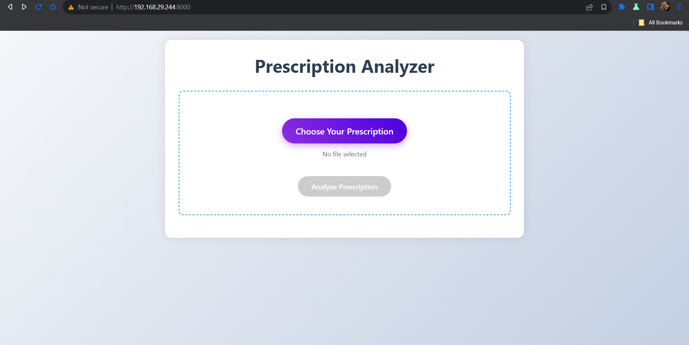
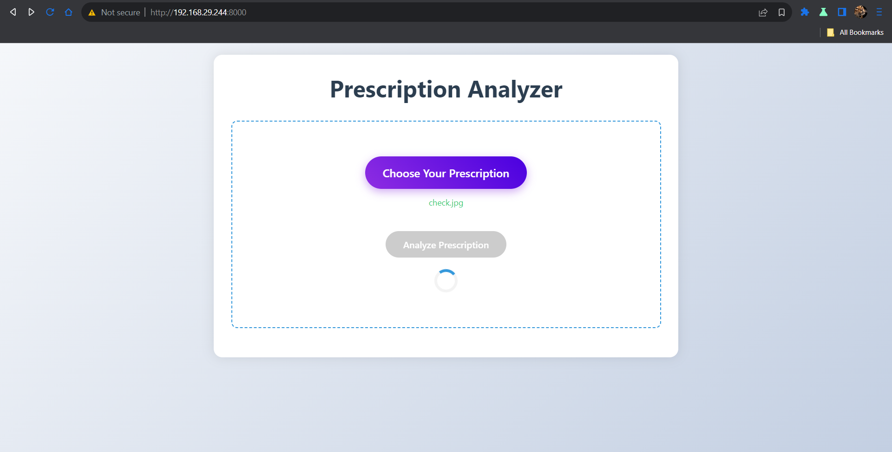
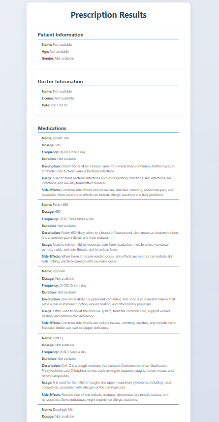

# Prescription Extraction AI

This project offers two Flask-based solutions for extracting medical information from prescription images or PDFs using Google's Gemini AI:
1. **Standalone API (`stand_alone_api.py`)**: A lightweight API for programmatic integration.
2. **Web App (`app.py`)**: A user-friendly web interface for uploading prescriptions and viewing results.

Depending on your use case, you can choose either the API for backend integration or the web app for an interactive experience.

## Features
- Supports image (`jpg`, `jpeg`, `png`) and PDF file formats.
- Converts PDFs to images for processing.
- Extracts structured medical data (patient info, doctor details, medications, notes) using Google's Gemini AI.
- **Standalone API**: Returns JSON data for integration into other systems.
- **Web App**: Provides a magical UI with sparkling buttons and detailed result display.

## Screenshots (Web App)
Here are some glimpses of the web app in action:









## Prerequisites
- Python 3.8 or higher
- A Google Gemini API key from [Google AI Studio](https://aistudio.google.com/apikey)

## Setup Guide

### Clone the Repository
```bash
git clone https://github.com/your-repo/prescription-extraction.git
cd prescription-extraction
```

### Install Dependencies
#### Option 1: Using `requirements.txt`
```bash
pip install -r requirements.txt
```
#### Option 2: Manual Installation
```bash
pip install python-dotenv google-generativeai flask pymupdf pillow
```

### Set Up Environment Variables
Create a `.env` file in the root directory with your Google Gemini API key:
```env
GEMINI_API_KEY="your_api_key_here"
```

## Running the Project

### Option 1: Standalone API (`stand_alone_api.py`)
For developers needing a backend API:
1. Run the API:
   ```bash
   python stand_alone_api.py
   ```
2. The server starts at `http://0.0.0.0:8000/`.

#### API Endpoint
- **POST `/extract-prescription/`**
  - **Request**: Upload a file using `multipart/form-data` with key `file`.
  - **Example cURL**:
    ```bash
    curl -X POST "http://127.0.0.1:8000/extract-prescription/" -F "file=@test_cases/check.jpg"
    ```
  - **Response**: JSON with extracted prescription data (see example below).

### Option 2: Web App (`app.py`)
For users wanting a graphical interface:
1. Run the web app:
   ```bash
   python app.py
   ```
2. Open your browser to `http://127.0.0.0:8000/`.
3. Upload a prescription and watch the magic unfold!

#### Web App Usage
- **Home Page**: Click "Choose Your Prescription" to select a file, then "Analyze Prescription".
- **Result Page**: View extracted details and analyze another prescription if needed.

## Example JSON Output
```json
{
    "Patient's full name": "John Doe",
    "Patient's age": "45y",
    "Patient's gender": "Male",
    "Doctor's full name": "Dr. Jane Smith",
    "Doctor's license number": "ABC123456",
    "Prescription date": "2023-04-01",
    "Medications": [
        {
            "Medication name": "Amoxicillin",
            "Dosage": "500 mg",
            "Frequency": "Twice a day (TD)",
            "Duration": "7 days",
            "Medicine Description": "An antibiotic used to treat bacterial infections.",
            "Medicine Usage": "Take to combat infections like pneumonia.",
            "Medicine Side effects": "May cause nausea or rash."
        }
    ],
    "Additional notes": {
        "General Advice": ["Take medication after food", "Monitor blood sugar"],
        "Duration": "(2)d: Two days",
        "Complaints of (c/o)": ["Dry cough"],
        "Contact Information": "WhatsApp: 4587632118",
        "Disclaimer": "Note: Not for Medico legal purpose"
    }
}
```

## Notes
- Ensure your Google API key is valid.
- PDFs are processed using the first page only.
- Invalid prescriptions return `"not a prescription"`.
- Web app stores results in `sessionStorage` for display.

## Choosing Between API and Web App
- **Use `stand_alone_api.py`** for integration into backend systems, mobile apps, or other frameworks (e.g., Django, MERN, PHP).
- **Use `app.py`** for a standalone, user-friendly experience with no coding required.